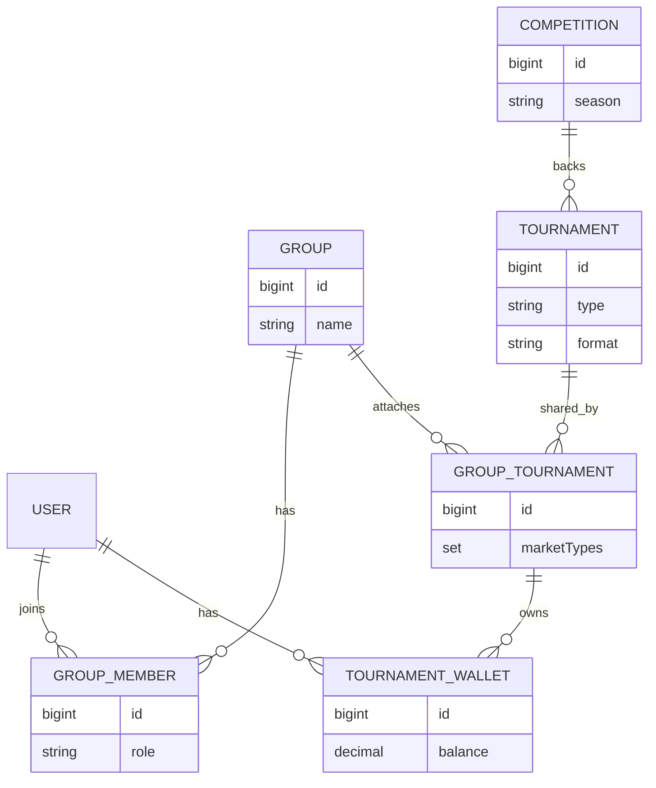
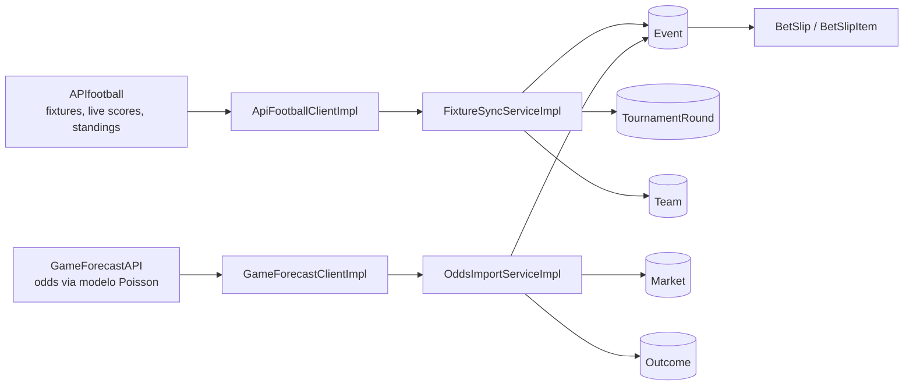
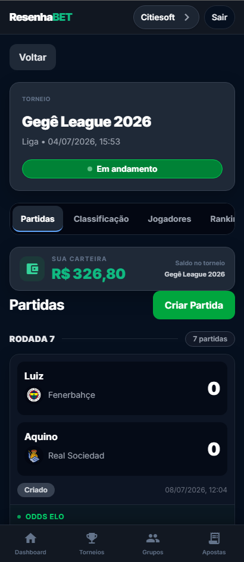
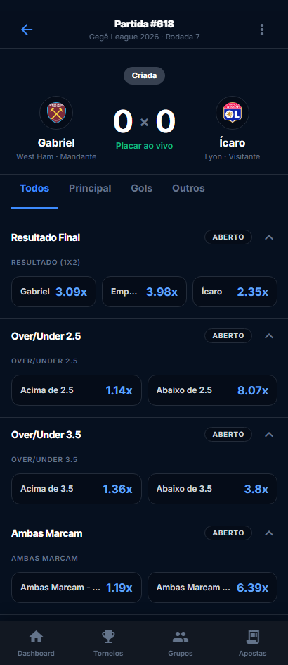
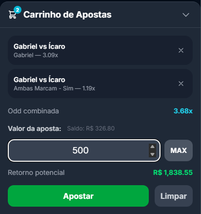
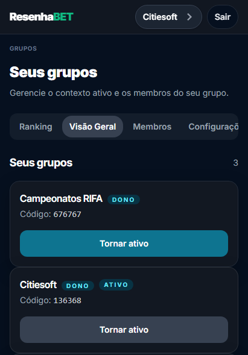

# ResenhaBET

Plataforma multi-grupo para campeonatos de FIFA entre amigos, com apostas internas e suporte a eventos de futebol real.

**[🔗 Acessar o projeto em produção](https://resenha-bet.vercel.app/)**

## A origem

O ResenhaBET nasceu durante um campeonato de FIFA entre amigos. No meio da resenha, surgiu a pergunta: "e se a gente pudesse apostar na gente mesmo, dentro do campeonato?".

A primeira ideia era simples: registrar partidas, ver ranking e brincar com apostas sem dinheiro real. O projeto cresceu porque as regras do próprio grupo começaram a exigir mais do sistema: formatos diferentes de torneio, odds, histórico, carteira, login e controle de quem podia fazer o quê.

Hoje o projeto é tratado como uma aplicação real. O backend já tem arquitetura multi-tenant, integrações externas, persistência relacional, migrations, testes e deploy ativo, mantendo a origem informal como parte da história do produto.

## O que o produto faz

- Gerencia campeonatos de FIFA para grupos fechados de amigos, com formatos `LEAGUE`, `BRACKET` e `LEAGUE_BRACKET`.
- Permite apostas entre os próprios jogadores e espectadores do grupo, sem casa de apostas e sem margem embutida.
- Suporta torneios de futebol real por meio de integrações externas para fixtures, placares e odds.
- Mantém múltiplos grupos isolados na mesma instalação, com jogadores, carteiras, apostas e permissões separados por contexto ativo.
- Reaproveita dados esportivos compartilhados quando faz sentido, como uma mesma competição real usada por mais de um grupo.

## Stack técnica

### Backend

O backend usa **Java 17** com **Spring Boot 4.0.4**. Spring foi escolhido por oferecer um caminho direto para REST, JPA, validação, WebSocket e configuração por ambiente sem criar infraestrutura própria para cada parte.

O acesso a dados usa **Spring Data JPA** com **PostgreSQL** no schema `resenha`. PostgreSQL foi escolhido porque o domínio exige consistência transacional, constraints, índices e `JSONB` para armazenar respostas brutas de APIs externas.

As alterações de banco são versionadas com **Flyway 11.3.2**. O repositório tem **47 migrations**, da `V1` até a `V67`, refletindo uma evolução real de modelo em vez de um schema descartável.

DTOs são mapeados com **MapStruct 1.6.3**. A escolha reduz código repetitivo sem empurrar lógica de domínio para reflection ou mapeamento dinâmico.

A autenticação não usa JWT nem Spring Security. O projeto usa sessão em banco com token UUID porque o produto é voltado a grupos fechados, com necessidade de revogação simples e contexto ativo de grupo por sessão.

### Frontend

O frontend usa **Angular 21.2.0**, **TypeScript 5.9.2** e componentes orientados a signals. Angular foi escolhido por dar estrutura forte para telas com estado, formulários, rotas protegidas e consumo de APIs tipadas.

A comunicação em tempo real usa **STOMP via `@stomp/stompjs`**. Isso permite atualizar telas de evento, mercado e carteira quando uma partida muda de estado.

A interface usa **Tailwind CSS 4.1.12**. A escolha favorece iteração rápida sem abandonar consistência visual entre páginas.

### Infra

O backend tem **Dockerfile multi-stage** com Maven e Eclipse Temurin 17. Isso separa build e runtime, reduz dependências em produção e padroniza o artefato executado.

O `docker-compose.yml` atual sobe **PostgreSQL 17 Alpine** para reprodução local do banco. A aplicação roda separadamente via Maven ou imagem Docker.

O projeto já está deployado. O CI/CD existe fora deste repositório, então os workflows não aparecem em `.github/workflows/` aqui.

## Arquitetura



A decisão central é `GroupTournament`, não `Tournament.group_id`. Um torneio de FIFA fica ligado a um único grupo por regra de serviço, enquanto um torneio de futebol real pode ser compartilhado por vários grupos. Assim, o sistema não duplica dados esportivos globais como `Competition`, `Team`, `Event`, `Market` e `Outcome`, mas mantém economias, carteiras e apostas isoladas por grupo.



## Desafios técnicos resolvidos

**Timezone de +2h em partidas reais**

**Problema:** odds vindas da GameForecastAPI não encontravam o `Event` correto, mesmo quando os times batiam.

**Causa raiz:** `ApiFootballClientImpl` não enviava `timezone`, o banco armazenava `TIMESTAMP` sem timezone e `FixtureSyncServiceImpl.parseMatchDateTime()` fazia parse ingênuo para `LocalDateTime`.

**Solução:** `ApiFootballClientImpl.fetchEventsByLeague()`, `fetchLiveEvents()` e `fetchEventsByMatchId()` passaram a enviar `timezone=America/Fortaleza`; `OddsImportServiceImpl.parseStartDate()` converte `start_at` UTC da GameForecastAPI para o mesmo fuso antes da comparação.

**Casamento de times entre providers diferentes**

**Problema:** APIfootball e GameForecastAPI usam IDs diferentes para o mesmo time, então o importador de odds podia falhar silenciosamente.

**Causa raiz:** não existe ID universal entre os providers, e nomes de seleções podem divergir entre APIs.

**Solução:** `OddsImportServiceImpl.matchAndCacheTeam()` usa `Team.gameForecastTeamId` como cache self-healing. Se o ID ainda não existe, casa por nome uma vez, persiste o ID descoberto e evita rematches futuros.

**Resolução de grupos em fase de grupos**

**Problema:** fixtures de futebol real não traziam `Group A`, `Group B` etc. por partida.

**Causa raiz:** o payload de eventos retornava campos genéricos para a competição, sem granularidade por grupo.

**Solução:** `FixtureSyncServiceImpl.buildTeamGroupMap()` chama `ApiFootballClient.getStandings()`, monta um mapa `teamId -> groupName` e trata igualdade entre grupo do mandante e visitante como sinal de fase de grupos.

```java
String homeGroup = teamGroupMap.get(match.getHomeTeamId());
String awayGroup = teamGroupMap.get(match.getAwayTeamId());
boolean isGroupStageMatch = homeGroup != null && homeGroup.equals(awayGroup);
```

**Tenancy sem duplicar dados esportivos**

**Problema:** grupos diferentes precisam apostar de forma isolada, mas podem usar a mesma competição real.

**Causa raiz:** colocar `group_id` direto em `Tournament` duplicaria fixtures, eventos, mercados e times para cada grupo.

**Solução:** `TournamentServiceImpl.attachCurrentGroupWithMarketTypes()` cria ou reutiliza `GroupTournament`. A economia fica em `TournamentWallet`, uma carteira por usuário e por `GroupTournament`.

## Qualidade de engenharia

- O backend tem **37 classes de teste** com JUnit, Mockito e MockMvc standalone.
- O banco é evoluído por Flyway, com **47 migrations** versionadas até `V67`.
- O tratamento de erro é centralizado em `GlobalExceptionHandler`, com respostas padronizadas para exceções de domínio.
- O projeto usa Dockerfile para build/runtime do backend e Docker Compose para PostgreSQL local.
- Respostas externas são persistidas em `external_api_log.response_body` como `JSONB`, com APIfootball registrando o JSON bruto antes do parsing.
- `GameForecastClientImpl` tem replay mode para reaproveitar respostas gravadas e evitar gastar quota gratuita em desenvolvimento.
- O backend usa constraints de banco e regras de serviço para proteger invariantes como unicidade de `GroupTournament` por grupo/torneio e carteira por usuário/grupo-torneio.

O CI/CD existe no fluxo real do projeto, mas está configurado fora deste repositório. Por isso não há workflows versionados em `.github/workflows/` aqui.

## Rodando localmente

Se preferir só explorar o produto sem configurar o ambiente, o projeto está no ar em [resenha-bet.vercel.app](https://resenha-bet.vercel.app/).

Pré-requisitos:

- Java 17
- Maven Wrapper do projeto
- Node/npm compatível com o frontend Angular
- Docker e Docker Compose

1. Configure as variáveis do backend.

```bash
cd backend
cp .env.example .env
```

Preencha `DB_USER`, `DB_PASSWORD`, `DB_URL`, `DB_NAME` e, se for testar integrações reais, as chaves dos providers externos. O `application.properties` também espera `DB_PORT`; o `.env.example` atual ainda não lista essa variável, então ela precisa ser adicionada ao `.env` local.

Não coloque valores reais em commits.

2. Suba o PostgreSQL local.

```bash
docker compose up -d
```

3. Rode o backend.

```bash
./mvnw spring-boot:run
```

No Windows sem shell Unix, use `mvnw.cmd spring-boot:run`.

4. Rode o frontend.

```bash
cd ../frontend
npm install
npm start
```

Observação: A integração com APIfootball está implementada e foi validada em produção durante o desenvolvimento, mas o plano gratuito usado para construí-la expirou. A migração para um provider substituto (fixtures/scores) já está mapeada e é o primeiro item do roadmap — a camada de odds (GameForecastAPI) não é afetada.

## Roadmap

- Substituir APIfootball por outro provider de fixtures, scores e standings.
- Melhorar discovery de competições reais para reduzir cadastro manual de IDs externos.
- Evoluir odds dinâmicas e cashout com histórico de odds por outcome.
- Endurecer a experiência multi-grupo no frontend e continuar testando isolamento entre grupos.

## Screenshots

<!-- screenshot: dashboard -->


<!-- screenshot: live-event -->


<!-- screenshot: betting -->


<!-- screenshot: groups -->

