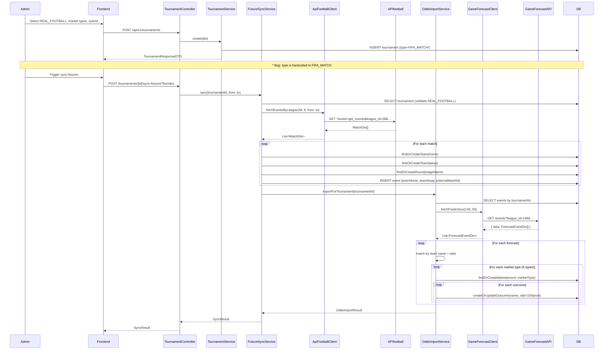
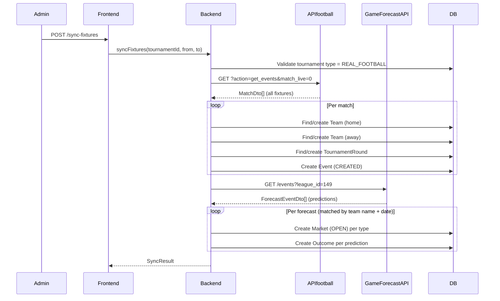

# REAL_FOOTBALL Project Overview

## Executive Summary

REAL_FOOTBALL is a feature group that extends the ResenhaBET v2 betting platform from FIFA video-game match simulations (`FIFA_MATCH`) to real-world football (soccer) tournaments, specifically targeting the 2026 World Cup. It introduces:

- **Team-based events** (instead of player-vs-player), sourced from the APIfootball external API.
- **Multiple betting markets per event** (1X2, Over/Under, BTTS, Exact Score, First Half), with odds imported from the GameForecastAPI.
- **Automated fixture synchronization** and **live score polling** (partially implemented).
- **Frontend adaptations** for team badges, multi-market tabs, and market-type-aware bet cart.

The feature coexists with the existing `FIFA_MATCH` system. Existing entities (`BetSlip`, `Wallet`, `Transaction`) remain unchanged.

---

## High-Level Architecture

```
┌──────────────────────────────────────────────────────────────────────────┐
│                          FRONTEND (Angular)                              │
│                                                                          │
│  HomePage ──► TournamentPage ──► EventPage                               │
│  (create tournament,    (view matches,      (view match detail,          │
│   select type,           team badges,        multi-market tabs,          │
│   market checklist)      odds grid)          bet cart)                   │
│                                                                          │
│  Services: TournamentsApi, EventsApi, MarketsApi, TeamsApi, BetCartService│
│  WebSocket: /topic/events/{id}, /topic/markets/{id}, /topic/wallet/{userId}│
└──────────────────────────────┬───────────────────────────────────────────┘
                               │ HTTP REST (JSON)
┌──────────────────────────────▼───────────────────────────────────────────┐
│                       BACKEND (Spring Boot 4.0.4 / Java 17)              │
│                                                                          │
│  Controllers: TournamentController, MarketController, EventController,   │
│               TeamController                                             │
│                                                                          │
│  Core Services:                                                          │
│    FixtureSyncService ──► ApiFootballClient ──► APIfootball (external)   │
│    OddsImportService ──► GameForecastClient ──► GameForecastAPI (external)│
│    EventService (validation gate for REAL_FOOTBALL)                      │
│    MarketService (multi-market per event)                                │
│    TournamentService (creates tournament, hardcodes FIFA_MATCH)          │
│                                                                          │
│  Scheduler: RealFootballScheduler (PLANNED — NOT YET IMPLEMENTED)        │
│                                                                          │
│  Domain: Tournament, Event, Market, Outcome, Team, TournamentRound       │
│  Enums: TournamentType, MarketType, EventStatus, MarketStatus            │
└──────────────────────────────┬───────────────────────────────────────────┘
                               │ JPA / Hibernate
┌──────────────────────────────▼───────────────────────────────────────────┐
│                  PostgreSQL (schema: resenha)                             │
│                                                                          │
│  Tables: tournament, event, market, outcome, team, tournament_round,     │
│          bet_slip, bet_slip_item, wallet, transaction, player, user ...   │
│                                                                          │
│  Key migrations: V13 (team), V25 (nullable players), V29 (team FKs),     │
│                  V30 (market_type), V32 (drop team abbreviation unique)   │
└──────────────────────────────────────────────────────────────────────────┘

┌──────────────────────────────────────────────────────────────────────────┐
│                      EXTERNAL PROVIDERS                                   │
│                                                                          │
│  APIfootball (apiv3.apifootball.com)                                     │
│    - Fixture sync: GET ?action=get_events&league_id=28&country_id=8      │
│    - Live scores: GET ?action=get_events&match_live=1&league_id=28       │
│    - Auth: query param APIkey                                            │
│                                                                          │
│  GameForecastAPI (game-forecast-api.p.rapidapi.com)                      │
│    - Predictions: GET /events?league_id=149&page_size=50                 │
│    - Auth: X-RapidAPI-Key header                                        │
│    - Returns: match_result, total_goals, both_teams_score,               │
│               exact_score, first_half_winner probabilities               │
└──────────────────────────────────────────────────────────────────────────┘
```

---

## Feature Entry Points

### Frontend Pages

| Route | Component | REAL_FOOTBALL Relevance |
|-------|-----------|------------------------|
| `/` | `HomePage` | Tournament creation modal with type toggle (FIFA_MATCH / REAL_FOOTBALL), market type checklist for REAL_FOOTBALL |
| `/tournaments/:id` | `TournamentPage` | Displays team badges, team names, multi-market odds grid (MATCH_RESULT market shown on match cards) |
| `/events/:id` | `EventPage` | Team badges/abbreviations, market type tabs (tabs shown when >1 market type available), outcome labels replaced with team names |
| `/teams` | `TeamsPage` | Team management (prerequisite for REAL_FOOTBALL) |

### Backend Endpoints

| Method | Path | Controller | REAL_FOOTBALL Relevance |
|--------|------|-----------|------------------------|
| `POST` | `/api/v1/tournaments` | `TournamentController` | Creates tournament (NOTE: currently hardcodes `FIFA_MATCH` — see Findings) |
| `POST` | `/api/v1/tournaments/{id}/sync-fixtures` | `TournamentController` | Triggers fixture sync + odds import for REAL_FOOTBALL tournaments |
| `POST` | `/api/v1/tournaments/{id}/sync-odds` | `TournamentController` | Re-imports odds for REAL_FOOTBALL tournaments |
| `GET` | `/api/v1/markets/{eventId}` | `MarketController` | Returns `List<MarketResponseDTO>` (all markets for event, including multiple types) |
| `POST` | `/api/v1/markets/{eventId}/status` | `MarketController` | Opens/closes ALL markets for an event |
| `GET` | `/api/v1/teams` | `TeamController` | Lists all teams (used for REAL_FOOTBALL team badges) |
| `POST` | `/api/v1/teams` | `TeamController` | Creates team manually |

### Scheduled Jobs

| Job | Status | Description |
|-----|--------|-------------|
| `RealFootballScheduler.tick()` | **NOT IMPLEMENTED** | Planned: runs every 60s, calls `autoStartEvents()` and `pollLiveScores()` |
| `MarketScheduler` (existing) | Implemented | Suspends markets when `suspendAt` datetime passes |

### External Integrations

| Integration | Client Class | Methods |
|-------------|-------------|---------|
| APIfootball | `ApiFootballClientImpl` | `fetchEventsByLeague()`, `fetchLiveEvents()` |
| GameForecastAPI | `GameForecastClientImpl` | `fetchPredictions()` |

---

## Frontend Flow

### Home Page — Tournament Creation

**File:** `frontend/src/app/pages/home/home-page.ts` + `.html`

**Purpose:** Admin creates a new tournament, choosing between FIFA_MATCH and REAL_FOOTBALL.

**Components involved:**
- `HomePage` component with create modal
- `TournamentsApi.create()`

**Flow:**
1. Admin clicks "Criar Torneio" button (admin-only via `*appAdminOnly` directive).
2. Modal opens with tournament name input, type toggle buttons ("FIFA Match" / "Futebol Real").
3. When `REAL_FOOTBALL` is selected:
   - Format selector is hidden (forced to `LEAGUE_BRACKET`).
   - Generation mode selector is hidden (forced to `MANUAL`).
   - Third-place match checkbox is hidden (forced to `true`).
   - Start/end date inputs are hidden (omitted from request).
   - **Market type checklist appears** with 6 checkboxes:
     - `MATCH_RESULT` (always checked, disabled — mandatory)
     - `OVER_UNDER_25`, `OVER_UNDER_35`, `BTTS`, `EXACT_SCORE`, `FIRST_HALF_RESULT`
4. On submit, `createTournament()` sends:
   ```typescript
   {
     name, format: 'LEAGUE_BRACKET', type: 'REAL_FOOTBALL',
     marketTypes: ['MATCH_RESULT', ...selected], generationMode: 'MANUAL',
     hasThirdPlaceMatch: true
   }
   ```

**API calls:** `POST /api/v1/tournaments`

**User actions:** Select type, toggle market types, submit.

### Tournament Page — Match Listing

**File:** `frontend/src/app/pages/tournament/tournament-page.ts` + `.html`

**Purpose:** View all matches in a tournament with odds grid.

**Components involved:**
- `TournamentPage`, `MarketsApi`, `TeamsApi`, `BetCartService`

**Flow:**
1. Page loads tournament, events, players, teams, rounds.
2. For each event with status `CREATED`, loads markets via `MarketsApi.findByEventId()`.
3. `isRealFootball()` checks `tournament.type === 'REAL_FOOTBALL'`.
4. For REAL_FOOTBALL events:
   - `eventPlayerLabel()` returns `teamHomeName`/`teamAwayName` instead of player names.
   - Team badge displayed via `teamBadgeUrlById(event.teamHomeId)` — falls back to abbreviation initials.
   - `matchResultMarket()` finds the `MATCH_RESULT` market (or first available) for the odds grid.
   - Odds grid uses `market.marketType` for cart deduplication.
5. `addOutcomeToCart()` builds cart entry with team names for event label, `marketType` for dedup.

**API calls:** `GET /tournaments/{id}`, `GET /events?tournamentId=`, `GET /teams`, `GET /markets/{eventId}` (per event)

### Event Page — Match Detail

**File:** `frontend/src/app/pages/event/event-page.ts` + `.html`

**Purpose:** Detailed view of a single match with multi-market betting.

**Components involved:**
- `EventPage`, `MarketsApi`, `EventsApi`, `BetCartService`, `WebSocketService`

**Flow:**
1. Loads event by ID, then context (tournament, teams, players, rounds, markets).
2. `isRealFootball` computed: `tournament()?.type === 'REAL_FOOTBALL'`.
3. Display logic branches on `isRealFootball()`:
   - `displayHomeName()` → `event.teamHomeName` (vs player name).
   - `homeTeamBadgeUrl()` → looks up team badge by `event.teamHomeId`.
   - `homeInitials()` → team abbreviation (vs player initials).
   - Player assignment UI is hidden (`canAssignPlayers` is `false`).
4. **Market type tabs** appear when `availableMarketTypes().length > 1`:
   - Each tab corresponds to a `MarketType` present in the loaded markets.
   - `selectedMarketType` signal tracks active tab (defaults to `MATCH_RESULT`).
   - `activeMarket` computed finds the market matching `selectedMarketType`.
5. Outcome grid shows outcomes for the active market.
6. `outcomeLabel()` replaces "Vitória Casa"/"Vitória Fora" with actual team names for REAL_FOOTBALL.
7. `addOutcomeToCart()` includes `marketType` in cart entry for deduplication.
8. WebSocket subscriptions:
   - `/topic/events/{eventId}` — live score updates.
   - `/topic/markets/{eventId}` — market status changes.
   - `/topic/wallet/{userId}` — wallet balance updates.
9. Admin controls: start match, update score, end match, toggle market status.

**API calls:** `GET /events/{id}`, `GET /markets/{id}`, `POST /events/{id}/start`, `POST /events/{id}/score`, `POST /events/{id}/end`, `POST /markets/{id}/status`

### Live Now Modal

**File:** `frontend/src/app/pages/home/live-now-modal.html`

**Purpose:** Shows currently live events on the home page.

**Flow:** Uses fallback pattern: `event.teamHomeName || event.playerHomeName` — works for both REAL_FOOTBALL and FIFA_MATCH without explicit type checking.

### Bet Cart Service

**File:** `frontend/src/app/services/bet-cart.service.ts`

**REAL_FOOTBALL relevance:** `BetCartEntry` has optional `marketType?: string` field. Deduplication in `addEntry()` uses both `eventId` AND `marketType` to identify entries, allowing multiple markets per event in the cart (e.g., user can bet on both MATCH_RESULT and OVER_UNDER_25 for the same match).

---

## Backend Flow

### Tournament Creation

**Controller:** `TournamentController.createTournament()` → `TournamentServiceImpl.create()`

**File:** `backend/src/main/java/.../service/Impl/TournamentServiceImpl.java:86-112`

**Flow:**
1. Admin auth check via `currentUserContext.requireAdmin()`.
2. Builds `Tournament` entity from `TournamentRequestDTO`.
3. **IMPORTANT:** Currently hardcodes `.type(TournamentType.FIFA_MATCH)` at line 100 — the `type` field from the frontend request is NOT read (see Findings).
4. Saves tournament, returns response DTO.

**Entities involved:** `Tournament`

### Fixture Sync

**Controller:** `TournamentController.syncFixtures()` → `FixtureSyncServiceImpl.sync()`

**File:** `backend/src/main/java/.../service/Impl/FixtureSyncServiceImpl.java`

**Endpoint:** `POST /api/v1/tournaments/{id}/sync-fixtures?from={date}&to={date}`

**Flow:**
1. Admin auth check.
2. Validates tournament exists and `type == REAL_FOOTBALL` (throws `BusinessException` otherwise).
3. Reads `copaLeagueId` and `copaCountryId` from `ApiFootballProperties`.
4. Calls `apiFootballClient.fetchEventsByLeague(leagueId, countryId, from, to)`.
5. For each `MatchDto` in response:
   a. **Find or create home team:** looks up by `externalApiId`, then by name, or creates new `Team` with 3-letter abbreviation.
   b. **Find or create away team:** same logic.
   c. **Link external API data:** sets `externalApiId` and `badgeUrl` if not already set.
   d. **Determine round:** uses `stageName` (or `matchRound` as fallback). Creates `TournamentRound` with `PhaseType` determined by `determinePhaseType()`:
      - Contains "final", "semi", "quarter", "round of", "16", "8" → `KNOCKOUT`
      - Otherwise → `GROUP_STAGE`
   e. **Create Event:** with `teamHome`, `teamAway`, `externalMatchId`, `gameDatetime` (parsed from `matchDate` + `matchTime`), status `CREATED`, scores 0-0.
6. Chains to `oddsImportService.importForTournament(tournamentId)`.
7. Returns `SyncResult` with counts.

**Entities involved:** `Tournament`, `Event`, `Team`, `TournamentRound`
**Repositories:** `TournamentRepository`, `EventRepository`, `TeamRepository`, `RoundRepository`
**External:** `ApiFootballClient.fetchEventsByLeague()`

### Odds Import

**Controller:** `TournamentController.syncOdds()` → `OddsImportServiceImpl.importForTournament()`

**File:** `backend/src/main/java/.../service/Impl/OddsImportServiceImpl.java`

**Endpoint:** `POST /api/v1/tournaments/{id}/sync-odds`

**Flow:**
1. Validates tournament exists and `type == REAL_FOOTBALL`.
2. Reads `copaLeagueId` from `GameForecastProperties`.
3. Calls `gameForecastClient.fetchPredictions(leagueId, 50)` (auto-paginates).
4. Loads all events for tournament: `eventRepository.findAllByTournamentId()`.
5. For each `ForecastEventDto`:
   a. **Match to local event** via `findMatchingEvent()`:
      - Compares team names (case-insensitive) for both home and away.
      - If names match, also compares date (if both available).
      - Returns `null` if no match → logs warning and skips.
   b. Uses `predictions[0]` (first prediction element).
   c. Calls `importMarketsForEvent()` which imports 6 market types:

   | Market Type | Method | Outcomes Created |
   |-------------|--------|-----------------|
   | `MATCH_RESULT` | `importMatchResultMarket()` | "Vitória Casa" (home prob), "Empate" (draw prob), "Vitória Fora" (away prob) |
   | `OVER_UNDER_25` | `importOverUnder25Market()` | "Over 2.5", "Under 2.5" |
   | `OVER_UNDER_35` | `importOverUnder35Market()` | "Over 3.5", "Under 3.5" |
   | `BTTS` | `importBttsMarket()` | "Sim" (yes prob), "Não" (no prob) |
   | `EXACT_SCORE` | `importExactScoreMarket()` | Dynamic: one per score key (e.g., "2-0", "1-0"), filtered by `minExactScoreProbability` (default 2%), excludes "other" bucket |
   | `FIRST_HALF_RESULT` | `importFirstHalfResultMarket()` | "Vitória Casa", "Empate", "Vitória Fora" |

   d. For each market: `findOrCreateMarket()` — looks up by `(eventId, marketType)`, creates with status `OPEN` if not found.
   e. For each outcome: `createOrUpdateOutcome()`:
      - Calculates odd: `100 / probability` (rounded to 2 decimal places).
      - Applies minimum odd guard: if calculated odd < `minOdd` (1.05), uses `minOdd`.
      - If outcome already exists (by name): updates odd, increments `oddsUpdated`.
      - If new: creates outcome, increments `outcomesCreated`.

6. Returns `OddsImportResult` with counts.

**Entities involved:** `Tournament`, `Event`, `Market`, `Outcome`
**Repositories:** `TournamentRepository`, `EventRepository`, `MarketRepository`, `OutcomeRepository`
**External:** `GameForecastClient.fetchPredictions()`

### Event Creation Validation Gate

**File:** `backend/src/main/java/.../service/Impl/EventServiceImpl.java:525-529`

**Flow:**
1. `validateEventCreation()` checks `tournament.getType()`.
2. If `REAL_FOOTBALL`: throws `BusinessException("Events for REAL_FOOTBALL tournaments must be created via fixture sync.")`.
3. This prevents manual event creation for REAL_FOOTBALL — all events must come from the APIfootball sync pipeline.

### Market Query (Multi-Market)

**Controller:** `MarketController.getMarketsByEvent()` → `MarketServiceImpl.findAllByEventId()`

**File:** `backend/src/main/java/.../service/Impl/MarketServiceImpl.java:39-52`

**Flow:**
1. Validates event exists.
2. Calls `marketRepository.findAllByEventId(eventId)` — returns ALL markets (not just one).
3. Maps each market to `MarketResponseDTO` with outcomes.
4. Returns `List<MarketResponseDTO>`.

**This is a breaking change from the original single-market behavior** — the frontend already consumes this as an array.

### Market Status Toggle

**File:** `backend/src/main/java/.../service/Impl/MarketServiceImpl.java:70-102`

**Flow:**
1. `openMarket()` / `closeMarket()` — iterates ALL markets for the event and sets status.
2. Publishes `MarketChangeEvent` for each market (triggers WebSocket broadcast).

---

## Database Model

### Tables

#### `tournament`
| Column | Type | Constraints | Notes |
|--------|------|-------------|-------|
| `id` | BIGSERIAL | PK | |
| `version` | BIGINT | | Optimistic locking (`@Version`) |
| `uuid` | UUID | UNIQUE, NOT NULL | |
| `name` | VARCHAR | NOT NULL | |
| `type` | VARCHAR (enum) | | `FIFA_MATCH` or `REAL_FOOTBALL` |
| `format` | VARCHAR (enum) | | `LEAGUE`, `BRACKET`, `LEAGUE_BRACKET` |
| `status` | VARCHAR (enum) | | `CREATED`, `IN_PROGRESS`, `ENDED` |
| `start_date` | TIMESTAMP | | Null for REAL_FOOTBALL |
| `end_date` | TIMESTAMP | | Null for REAL_FOOTBALL |
| `generation_mode` | VARCHAR (enum) | NOT NULL, default `MANUAL` | |
| `has_third_place_match` | BOOLEAN | NOT NULL, default `false` | Forced `true` for REAL_FOOTBALL |
| `number_of_groups` | INT | NOT NULL, default 1 | |
| `players_advancing_per_group` | INT | NOT NULL, default 2 | |

#### `team`
| Column | Type | Constraints | Notes |
|--------|------|-------------|-------|
| `id` | BIGSERIAL | PK | |
| `name` | VARCHAR(255) | UNIQUE, NOT NULL | |
| `abbreviation` | VARCHAR(4) | NOT NULL (was UNIQUE, dropped in V32) | V32 dropped unique constraint for imported teams |
| `external_api_id` | BIGINT | UNIQUE | APIfootball team ID |
| `badge_url` | VARCHAR(255) | | Team logo URL from APIfootball |

#### `event`
| Column | Type | Constraints | Notes |
|--------|------|-------------|-------|
| `id` | BIGSERIAL | PK | |
| `tournament_id` | BIGINT | FK → tournament | |
| `round_id` | BIGINT | FK → tournament_round | |
| `player_home_id` | BIGINT | FK → player (NULLABLE) | V25 made nullable |
| `player_away_id` | BIGINT | FK → player (NULLABLE) | V25 made nullable |
| `team_home_id` | BIGINT | FK → team | V29 — REAL_FOOTBALL |
| `team_away_id` | BIGINT | FK → team | V29 — REAL_FOOTBALL |
| `external_match_id` | VARCHAR(20) | | V29 — APIfootball `match_id` |
| `game_datetime` | TIMESTAMP | NULLABLE | V25 made nullable |
| `status` | VARCHAR (enum) | NOT NULL | `CREATED`, `IN_PROGRESS`, `COMPLETED`, `CANCELLED`, `PENALTIES` |
| `home_score` | INT | | |
| `away_score` | INT | | |
| `home_elo_before` | DECIMAL | | FIFA_MATCH only |
| `away_elo_before` | DECIMAL | | FIFA_MATCH only |
| `is_knockout` | BOOLEAN | | |
| `is_bye` | BOOLEAN | NOT NULL, default `false` | |
| `penalties_home` | INT | | |
| `penalties_away` | INT | | |
| `next_round_event_id` | BIGINT | FK → event | |
| `home_source_event_id` | BIGINT | FK → event | |
| `away_source_event_id` | BIGINT | FK → event | |
| `is_third_place_match` | BOOLEAN | NOT NULL, default `false` | |

**Invariant (service-level, not DB constraint):**
- `FIFA_MATCH`: `player_home_id` and `player_away_id` required; `team_home_id`/`team_away_id` null.
- `REAL_FOOTBALL`: `team_home_id` and `team_away_id` required; `player_home_id`/`player_away_id` null.

#### `market`
| Column | Type | Constraints | Notes |
|--------|------|-------------|-------|
| `id` | BIGSERIAL | PK | |
| `event_id` | BIGINT | FK → event | |
| `name` | VARCHAR | | e.g., "Resultado Final", "Over/Under 2.5" |
| `status` | VARCHAR (enum) | NOT NULL | `OPEN`, `SUSPENDED`, `CLOSED` |
| `market_type` | VARCHAR(30) | NOT NULL, default `MATCH_RESULT` | V30 |

**Unique constraint:** `UNIQUE(event_id, market_type)` — V30 replaced `UNIQUE(event_id)`.

#### `outcome`
| Column | Type | Constraints | Notes |
|--------|------|-------------|-------|
| `id` | BIGSERIAL | PK | |
| `market_id` | BIGINT | FK → market | |
| `name` | VARCHAR | | e.g., "Vitória Casa", "Over 2.5", "2-0" |
| `odd` | DECIMAL | | Calculated from probability or Elo |

### Relationships

```
tournament 1──N tournament_round
tournament 1──N event
tournament 1──N tournament_player
team 1──N event (via team_home_id, team_away_id)
event 1──N market
market 1──N outcome
event N──1 player (via player_home_id, player_away_id — FIFA_MATCH only)
```

### Key Migrations

| Migration | Description |
|-----------|-------------|
| `V13__CREATE_TEAM_TABLE.sql` | Creates `team` table with `external_api_id`, `badge_url` |
| `V25__ALTER_EVENT_MAKE_PLAYERS_NULLABLE.sql` | Makes `player_home_id`, `player_away_id`, `game_datetime` nullable |
| `V29__ADD_EVENT_REAL_FOOTBALL_COLUMNS.sql` | Adds `team_home_id`, `team_away_id`, `external_match_id` to `event` |
| `V30__ADD_MARKET_TYPE.sql` | Adds `market_type` column, changes unique constraint to `(event_id, market_type)` |
| `V32__DROP_UNIQUE_TEAM_ABBREVIATION.sql` | Drops unique constraint on team `abbreviation` for imported teams |

---

## External Integrations

### APIfootball

**Client:** `ApiFootballClientImpl` (`backend/src/main/java/.../service/Impl/ApiFootballClientImpl.java`)

**Configuration:**
```properties
resenhabet.apifootball.key=<API_KEY>
resenhabet.apifootball.base-url=https://apiv3.apifootball.com
resenhabet.apifootball.copa-league-id=28
resenhabet.apifootball.copa-country-id=8
```

**Endpoints used:**

| Method | API Call | Query Params |
|--------|----------|-------------|
| `fetchEventsByLeague()` | `GET /?action=get_events` | `league_id`, `country_id`, `from`, `to`, `APIkey` |
| `fetchLiveEvents()` | `GET /?action=get_events` | `league_id`, `country_id`, `match_live=1`, `APIkey` |

**Data received:** `MatchDto[]` — fields: `match_id`, `match_date`, `match_time`, `match_status`, `match_hometeam_id`, `match_hometeam_name`, `match_hometeam_score`, `match_awayteam_id`, `match_awayteam_name`, `match_awayteam_score`, `match_hometeam_halftime_score`, `match_awayteam_halftime_score`, `match_hometeam_extra_score`, `match_awayteam_extra_score`, `match_hometeam_penalty_score`, `match_awayteam_penalty_score`, `team_home_badge`, `team_away_badge`, `match_round`, `stage_name`.

**Data persisted:** `Team` (name, abbreviation, externalApiId, badgeUrl), `Event` (teamHome, teamAway, externalMatchId, gameDatetime, status, scores), `TournamentRound` (name, phaseType, roundOrder).

**Error handling:** Catches all exceptions, logs error, returns `Collections.emptyList()`. No retry logic.

### GameForecastAPI

**Client:** `GameForecastClientImpl` (`backend/src/main/java/.../service/Impl/GameForecastClientImpl.java`)

**Configuration:**
```properties
resenhabet.gameforecast.rapidapi-key=<RAPIDAPI_KEY>
resenhabet.gameforecast.base-url=https://game-forecast-api.p.rapidapi.com
resenhabet.gameforecast.copa-league-id=149
resenhabet.gameforecast.min-exact-score-probability=2
```

**Endpoint used:**

| Method | API Call | Headers | Query Params |
|--------|----------|---------|-------------|
| `fetchPredictions()` | `GET /events` | `X-RapidAPI-Key`, `X-RapidAPI-Host: game-forecast-api.p.rapidapi.com` | `league_id`, `page_size`, `page`, `include_all_history=false` |

**Pagination:** Auto-paginates — continues fetching while response size equals `pageSize`.

**Data received:** `ForecastEventDto` — fields: `id`, `start_at`, `team_home` (name, id), `team_away` (name, id), `predictions[]` containing:
- `match_result`: `{ home, draw, away }` (integer probabilities summing to ~100)
- `total_goals`: `{ over_2_5, under_2_5, over_3_5, under_3_5 }`
- `both_teams_score`: `{ yes, no }`
- `exact_score`: `Map<String, Integer>` (keys like "2_0", "1_0", "other")
- `first_half_winner`: `{ home, draw, away }`

**Data persisted:** `Market` (marketType, name, status), `Outcome` (name, odd calculated from probability).

**Error handling:** Catches exceptions per page, logs error, stops pagination. No retry.

**Rate limiting considerations:**
- Free tier: 10 requests/day, 10/hour — extremely restrictive.
- Pro tier ($19/mo): 5,000/month — sufficient for regular syncs.
- Auto-pagination means a single `fetchPredictions()` call may consume 2+ API requests.

---

## End-to-End Lifecycle

### Tournament Creation

1. Admin opens home page, clicks "Criar Torneio".
2. Selects "Futebol Real" type toggle.
3. Checks desired market types (MATCH_RESULT always included).
4. Submits form → `POST /api/v1/tournaments` with `type: 'REAL_FOOTBALL'`, `format: 'LEAGUE_BRACKET'`, `marketTypes: [...]`, `generationMode: 'MANUAL'`, `hasThirdPlaceMatch: true`.
5. Backend `TournamentServiceImpl.create()` saves tournament.
   - **NOTE:** Currently hardcodes `type = FIFA_MATCH` — the `type` field from DTO is ignored. This is a bug (see Findings).

### Match Synchronization

1. Admin triggers `POST /api/v1/tournaments/{id}/sync-fixtures?from=2026-06-01&to=2026-07-20`.
2. `FixtureSyncServiceImpl.sync()`:
   - Validates tournament is `REAL_FOOTBALL`.
   - Calls `ApiFootballClient.fetchEventsByLeague("28", "8", from, to)` → 1 API request.
   - For each match in response:
     - Finds or creates `Team` entities (home and away), linking `externalApiId` and `badgeUrl`.
     - Determines `TournamentRound` from `stage_name` → creates if not exists with appropriate `PhaseType`.
     - Creates `Event` with `teamHome`, `teamAway`, `externalMatchId`, `gameDatetime`, status `CREATED`.
   - Chains to `OddsImportService.importForTournament()`.
3. `OddsImportServiceImpl.importForTournament()`:
   - Calls `GameForecastClient.fetchPredictions("149", 50)` → 1-2 API requests (auto-paginates).
   - For each forecast event, matches to local event by team name + date.
   - Creates/updates up to 6 `Market` entities per event with `Outcome`s.
   - Odds calculated as `100 / probability`, minimum 1.05.
4. Returns `SyncResult` with counts.

### Market Creation

1. During odds import, for each matched forecast event:
2. `findOrCreateMarket(event, marketType, name)`:
   - Queries `marketRepository.findByEventIdAndMarketType(eventId, marketType)`.
   - If not found: creates `Market` with `status = OPEN`, `marketType = <type>`, `name = <label>`.
3. For each outcome in the market:
   - `createOrUpdateOutcome(market, name, probability, result)`:
     - Calculates odd: `100 / probability`.
     - Applies `minOdd` guard (1.05).
     - If outcome exists by name: updates odd.
     - If new: creates `Outcome`.

### Odds Updates

1. Admin triggers `POST /api/v1/tournaments/{id}/sync-odds`.
2. Same flow as odds import step above.
3. Existing markets are found (not recreated), existing outcomes have their odds updated.
4. `OddsImportResult` reports `marketsCreated`, `outcomesCreated`, `oddsUpdated`.

### Settlement / Result Lifecycle

**Current state:** Settlement for REAL_FOOTBALL events follows the same path as FIFA_MATCH — via `EventService.finishEvent()` which resolves `BetSlipItem`s based on final score.

**Planned (NOT IMPLEMENTED):** `RealFootballScheduler.pollLiveScores()` would:
1. Check for `IN_PROGRESS` REAL_FOOTBALL events.
2. Call `ApiFootballClient.fetchLiveEvents()`.
3. Parse `match_status`:
   - Contains `"'"` or equals `"Half Time"` → match in progress, update scores.
   - Equals `"Finished"`, `"After ET"`, `"After Pen."` → call `EventService.finishEvent()`.
   - Equals `"Postponed"`, `"Cancelled"` → cancel event, refund bets.
4. Broadcast updates via WebSocket `/topic/events/{id}`.

---

## Sequence Diagrams (Mermaid)

### Tournament Creation + Fixture Sync



### Match Synchronization (Simplified)



### Settlement Flow (Planned — NOT IMPLEMENTED)

```mermaid
sequenceDiagram
    participant Scheduler
    participant APIfootball
    participant EventService
    participant BetService
    participant WalletService
    participant WebSocket
    participant DB

    loop Every 60 seconds
        Scheduler->>DB: Check for IN_PROGRESS REAL_FOOTBALL events
        alt No live events
            Scheduler->>Scheduler: Skip (zero API cost)
        else Live events exist
            Scheduler->>APIfootball: GET ?action=get_events&match_live=1
            APIfootball-->>Scheduler: MatchDto[] (live scores)

            loop Per live match
                Scheduler->>Scheduler: Parse match_status
                alt Contains "'" or "Half Time"
                    Scheduler->>DB: Update homeScore/awayScore
                    Scheduler->>WebSocket: Broadcast /topic/events/{id}
                alt "Finished" / "After ET" / "After Pen."
                    Scheduler->>EventService: finishEvent(eventId)
                    EventService->>DB: Event status → COMPLETED
                    EventService->>DB: Markets → CLOSED
                    EventService->>BetService: Resolve BetSlipItems
                    BetService->>DB: Determine WON/LOST per item
                    BetService->>WalletService: Credit winners
                    WalletService->>DB: UPDATE wallet balance
                    BetService->>WebSocket: Broadcast /topic/wallet/{userId}
                else "Postponed" / "Cancelled"
                    Scheduler->>EventService: cancelEvent(eventId)
                    EventService->>DB: Event status → CANCELLED
                    EventService->>BetService: Refund all stakes
                    BetService->>WalletService: Refund to wallets
                end
            end
        end
    end
```

---

## File Map

### Backend

| Responsibility | File |
|---------------|------|
| **Enums** | |
| TournamentType enum (REAL_FOOTBALL, FIFA_MATCH) | `backend/src/main/java/.../domain/enums/TournamentType.java` |
| MarketType enum (6 types) | `backend/src/main/java/.../domain/enums/MarketType.java` |
| **Entities** | |
| Tournament entity (type field) | `backend/src/main/java/.../domain/entity/Tournament.java` |
| Event entity (teamHome, teamAway, externalMatchId) | `backend/src/main/java/.../domain/entity/Event.java` |
| Market entity (marketType field) | `backend/src/main/java/.../domain/entity/Market.java` |
| Outcome entity | `backend/src/main/java/.../domain/entity/Outcome.java` |
| Team entity (externalApiId, badgeUrl) | `backend/src/main/java/.../domain/entity/Team.java` |
| **Repositories** | |
| MarketRepository (findByEventIdAndMarketType) | `backend/src/main/java/.../domain/repository/MarketRepository.java` |
| TeamRepository (findByExternalApiId, findByName) | `backend/src/main/java/.../domain/repository/TeamRepository.java` |
| EventRepository (findAllByTournamentId) | `backend/src/main/java/.../domain/repository/EventRepository.java` |
| **Configuration** | |
| ApiFootballProperties | `backend/src/main/java/.../config/ApiFootballProperties.java` |
| GameForecastProperties | `backend/src/main/java/.../config/GameForecastProperties.java` |
| OddsProperties (minOdd used by import) | `backend/src/main/java/.../config/OddsProperties.java` |
| Application properties (runtime config) | `backend/src/main/resources/application.properties` |
| **External API Clients** | |
| ApiFootballClient interface | `backend/src/main/java/.../service/ApiFootballClient.java` |
| ApiFootballClientImpl | `backend/src/main/java/.../service/Impl/ApiFootballClientImpl.java` |
| GameForecastClient interface | `backend/src/main/java/.../service/GameForecastClient.java` |
| GameForecastClientImpl | `backend/src/main/java/.../service/Impl/GameForecastClientImpl.java` |
| **Service DTOs (External API models)** | |
| MatchDto (APIfootball response) | `backend/src/main/java/.../service/dto/MatchDto.java` |
| ForecastEventDto (GameForecast response) | `backend/src/main/java/.../service/dto/ForecastEventDto.java` |
| **Core Services** | |
| FixtureSyncService interface | `backend/src/main/java/.../service/FixtureSyncService.java` |
| FixtureSyncServiceImpl | `backend/src/main/java/.../service/Impl/FixtureSyncServiceImpl.java` |
| OddsImportService interface | `backend/src/main/java/.../service/OddsImportService.java` |
| OddsImportServiceImpl | `backend/src/main/java/.../service/Impl/OddsImportServiceImpl.java` |
| EventServiceImpl (validation gate) | `backend/src/main/java/.../service/Impl/EventServiceImpl.java` |
| MarketServiceImpl (multi-market) | `backend/src/main/java/.../service/Impl/MarketServiceImpl.java` |
| TournamentServiceImpl (create tournament) | `backend/src/main/java/.../service/Impl/TournamentServiceImpl.java` |
| **Controllers** | |
| TournamentController (sync-fixtures, sync-odds) | `backend/src/main/java/.../controller/TournamentController.java` |
| MarketController (list markets by event) | `backend/src/main/java/.../controller/MarketController.java` |
| TeamController | `backend/src/main/java/.../controller/TeamController.java` |
| **Controller DTOs** | |
| EventResponseDTO (team fields) | `backend/src/main/java/.../controller/dto/response/EventResponseDTO.java` |
| MarketResponseDTO (marketType) | `backend/src/main/java/.../controller/dto/response/MarketResponseDTO.java` |
| SyncResult | `backend/src/main/java/.../controller/dto/response/SyncResult.java` |
| OddsImportResult | `backend/src/main/java/.../controller/dto/response/OddsImportResult.java` |
| TournamentRequestDTO (missing type field) | `backend/src/main/java/.../controller/dto/request/TournamentRequestDTO.java` |
| **Mappers** | |
| EventMapper (teamHome/away mappings) | `backend/src/main/java/.../mapper/EventMapper.java` |
| MarketMapper (marketType mapping) | `backend/src/main/java/.../mapper/MarketMapper.java` |
| **Database Migrations** | |
| V13 — Create team table | `backend/src/main/resources/db/migration/V13__CREATE_TEAM_TABLE.sql` |
| V25 — Make players nullable | `backend/src/main/resources/db/migration/V25__ALTER_EVENT_MAKE_PLAYERS_NULLABLE.sql` |
| V29 — Add REAL_FOOTBALL event columns | `backend/src/main/resources/db/migration/V29__ADD_EVENT_REAL_FOOTBALL_COLUMNS.sql` |
| V30 — Add market_type | `backend/src/main/resources/db/migration/V30__ADD_MARKET_TYPE.sql` |
| V32 — Drop team abbreviation unique | `backend/src/main/resources/db/migration/V32__DROP_UNIQUE_TEAM_ABBREVIATION.sql` |

### Frontend

| Responsibility | File |
|---------------|------|
| **Types / Models** | |
| API models (MarketType, EventResponseDto, etc.) | `frontend/src/app/services/api/api.models.ts` |
| **Pages** | |
| Home page (tournament creation) | `frontend/src/app/pages/home/home-page.ts` |
| Home page template | `frontend/src/app/pages/home/home-page.html` |
| Tournament page | `frontend/src/app/pages/tournament/tournament-page.ts` |
| Tournament page template | `frontend/src/app/pages/tournament/tournament-page.html` |
| Event page (match detail) | `frontend/src/app/pages/event/event-page.ts` |
| Event page template | `frontend/src/app/pages/event/event-page.html` |
| Live now modal | `frontend/src/app/pages/home/live-now-modal.ts` |
| Live now modal template | `frontend/src/app/pages/home/live-now-modal.html` |
| **Services / API Clients** | |
| TournamentsApi | `frontend/src/app/services/api/tournaments-api.ts` |
| EventsApi | `frontend/src/app/services/api/events-api.ts` |
| MarketsApi | `frontend/src/app/services/api/markets-api.ts` |
| TeamsApi | `frontend/src/app/services/api/teams-api.ts` |
| BetCartService | `frontend/src/app/services/bet-cart.service.ts` |
| WebSocketService | `frontend/src/app/services/websocket.service.ts` |
| **Routing** | |
| App routes | `frontend/src/app/app.routes.ts` |

---

## Dependency Map

```
┌─────────────────────────────────────────────────────────────────────┐
│                        FRONTEND                                      │
│                                                                       │
│  HomePage ──► TournamentsApi ──────────────────────┐                 │
│  TournamentPage ──► EventsApi ─────────────────────┤                 │
│                   ► MarketsApi ────────────────────┤                 │
│                   ► TeamsApi ──────────────────────┤                 │
│  EventPage ─────► EventsApi, MarketsApi ──────────┤                 │
│                   ► BetCartService ──► BetsApi ────┤                 │
│                   ► WebSocketService ──────────────┤                 │
│                                                     │                │
└─────────────────────────────────────────────────────┼────────────────┘
                                                      │ HTTP REST
                                                      ▼
┌─────────────────────────────────────────────────────────────────────┐
│                        BACKEND                                       │
│                                                                       │
│  TournamentController ──► TournamentService ──► TournamentRepository │
│                       ──► FixtureSyncService ──► ApiFootballClient   │
│                       ──► OddsImportService ──► GameForecastClient   │
│                                                                       │
│  MarketController ──► MarketService ──► MarketRepository              │
│                                    ──► OutcomeRepository              │
│                                                                       │
│  EventController ──► EventService ──► EventRepository                │
│                                  (blocks manual creation for RF)     │
│                                                                       │
│  FixtureSyncService ──► TeamRepository                               │
│                     ──► RoundRepository                              │
│                     ──► OddsImportService (chained)                  │
│                                                                       │
│  ApiFootballClient ──────────────────┐                               │
│  GameForecastClient ─────────────────┤                               │
│                                       │                              │
└───────────────────────────────────────┼──────────────────────────────┘
                                        │ HTTP
                                        ▼
┌───────────────────────────────────────────────────────────────────────┐
│                    EXTERNAL APIs                                       │
│                                                                        │
│  APIfootball ◄── ApiFootballClient                                    │
│    (fixtures, live scores)                                             │
│                                                                        │
│  GameForecastAPI ◄── GameForecastClient                               │
│    (predictions, odds)                                                 │
│                                                                        │
└───────────────────────────────────────────────────────────────────────┘

┌───────────────────────────────────────────────────────────────────────┐
│                    DATABASE (PostgreSQL, schema: resenha)              │
│                                                                        │
│  tournament ──< event ──< market ──< outcome                          │
│  team ──< event (team_home_id, team_away_id)                          │
│  tournament_round ──< event                                           │
│  bet_slip ──< bet_slip_item ──> event, outcome                       │
│  wallet ──< transaction                                               │
│                                                                        │
└───────────────────────────────────────────────────────────────────────┘
```

---

## Known Technical Constraints

1. **APIfootball league_id and country_id are hardcoded** in `application.properties` (league_id=28, country_id=8). The briefing notes these should be discovered via `get_leagues` before implementation. No dynamic discovery mechanism exists.

2. **GameForecastAPI league_id is independent** from APIfootball's league_id. Both must be configured separately (currently 149 for GameForecast, 28 for APIfootball).

3. **Event matching between APIs is by team name + date** — no shared fixture ID. Case-insensitive name comparison is used. If names differ between APIs (e.g., "Brazil" vs "Brasil"), matching will fail silently with a warning log.

4. **No retry logic** on external API calls. Both clients catch all exceptions and return empty lists, which means a transient network failure during sync results in zero fixtures with no automatic recovery.

5. **`RealFootballScheduler` is NOT implemented.** The property `resenhabet.scheduler.live-poll-enabled=true` exists in `application.properties` but no scheduler class exists. Live score polling, auto-start of events, and automatic settlement for REAL_FOOTBALL are all non-functional.

6. **Tournament creation hardcodes `FIFA_MATCH`** — `TournamentServiceImpl.create()` at line 100 sets `.type(TournamentType.FIFA_MATCH)` regardless of what the frontend sends. The `TournamentRequestDTO` does not have a `type` field. This means REAL_FOOTBALL tournaments cannot be created through the normal creation flow.

7. **`marketTypes` from frontend creation request is ignored** — the `CreateTournamentRequestDto` in the frontend sends `marketTypes: string[]`, but the backend `TournamentRequestDTO` has no corresponding field. The market type selection during tournament creation has no effect.

8. **Team abbreviation uniqueness was dropped** (V32) to accommodate imported teams, but the `Team` entity still has `@Column(unique = true, nullable = false)` on `abbreviation` — a mismatch between entity annotation and actual DB schema.

9. **`EXACT_SCORE` "other" bucket is excluded** from outcomes as specified in the briefing. Scores below `minExactScoreProbability` (2%) are also excluded.

10. **Odds are static after import** — once imported, odds do not change unless admin manually triggers `sync-odds`. There is no automatic odds drift mechanism.

11. **Single `RestClient` per client** — no connection pooling, timeout configuration, or circuit breaker patterns are in place.

12. **The `findOrCreateTeam()` method in `FixtureSyncServiceImpl`** creates teams with a 3-letter abbreviation from the first 3 characters of the name. This can produce duplicates (e.g., "BRA" for Brazil and "BRA" for Brandenburg) — mitigated only by V32 dropping the unique constraint.

---

## Findings

### Missing Implementations

| Item | Description | Impact |
|------|-------------|--------|
| `RealFootballScheduler` | The entire live score polling, auto-start, and auto-settlement scheduler described in the briefing (RF-12 through RF-15) is not implemented. | REAL_FOOTBALL events cannot auto-start, scores cannot be auto-updated, and matches cannot auto-finish. All lifecycle management must be done manually via the existing admin controls on the Event page. |
| `TournamentRequestDTO.type` field | The backend DTO does not have a `type` field. The frontend sends `type: 'REAL_FOOTBALL'` but it is silently ignored. | REAL_FOOTBALL tournaments are always created as `FIFA_MATCH`. The sync-fixtures endpoint will reject them because it validates `type == REAL_FOOTBALL`. |
| Frontend `sync-fixtures` / `sync-odds` UI | No admin UI buttons exist in the frontend for triggering fixture sync or odds sync. The `TournamentsApi` service has no methods for these endpoints. | Admin must use direct HTTP calls (e.g., curl, Postman) to trigger sync operations. |
| `externalMatchId` in frontend `EventResponseDto` | The frontend type definition does not include `externalMatchId` (the backend DTO does). | The frontend cannot display or reference the external API match ID. |
| Market type filtering during tournament creation | The `marketTypes` array sent from the frontend is not consumed by the backend. All 6 market types are always imported during odds sync regardless of admin selection. | Admin's market type selection during creation has no effect — all markets are always created. |

### Inconsistencies Between Code and Briefing

| Briefing Statement | Actual Code | Discrepancy |
|-------------------|-------------|-------------|
| "Admin creates tournament REAL_FOOTBALL" → triggers fixture sync | Tournament creation (`POST /tournaments`) does NOT trigger sync. Sync is a separate endpoint (`POST /{id}/sync-fixtures`). | Briefing implies automatic sync on creation; code requires manual trigger. |
| `TournamentType` validation in `EventService` | `EventServiceImpl.validateEventCreation()` blocks manual event creation for REAL_FOOTBALL. | Consistent with briefing. |
| `GET /markets/{eventId}` returns `List<MarketResponseDTO>` | `MarketController` and `MarketServiceImpl.findAllByEventId()` return a list. | Consistent with briefing. Breaking change from original single-market behavior is implemented. |
| `ApiFootballClient.fetchEventsByLeague(leagueId, from, to)` | Actual signature: `fetchEventsByLeague(String leagueId, String countryId, LocalDate from, LocalDate to)` — includes `countryId` not mentioned in briefing interface. | Code has additional `countryId` parameter. |
| Briefing: `GameForecastClient.fetchPredictions(leagueId, pageSize)` | Code matches. Auto-pagination is implemented (not in briefing spec). | Code goes beyond briefing with auto-pagination. |
| Briefing mentions `suspendAt` on Market for scheduler | `Market` entity has no `suspendAt` field. The existing `MarketScheduler` is referenced but not found in the codebase for REAL_FOOTBALL context. | Market suspension mechanism for REAL_FOOTBALL is unclear. |
| Briefing: "WebSocket broadcast via `/topic/events/{id}`" | WebSocket infrastructure exists (`EventChangeEvent`, `MarketChangeEvent`). | Consistent — events are published via Spring `ApplicationEventPublisher`. |

### Potential Risks

1. **Tournament type cannot be set to REAL_FOOTBALL via the API** — the `TournamentServiceImpl.create()` hardcodes `FIFA_MATCH`. Until this is fixed, the entire REAL_FOOTBALL pipeline is unreachable through normal UI flow.

2. **No live score automation** — without `RealFootballScheduler`, all score updates, event starts, and settlements must be done manually by an admin on the Event page. This is operationally impractical for a 64-match tournament like the World Cup.

3. **API key exposure** — `application.properties` contains plaintext API keys for both APIfootball and GameForecastAPI. These should be externalized to environment variables.

4. **Name-based event matching is fragile** — if APIfootball and GameForecastAPI use different team name spellings, the odds import will silently skip those events. No admin notification mechanism exists beyond log warnings.

5. **No idempotency on fixture sync** — calling `sync-fixtures` twice will create duplicate events (no check for existing `externalMatchId`). The `findOrCreateTeam()` method prevents duplicate teams, but events are always created fresh.

6. **No transactional boundary around the full sync pipeline** — `FixtureSyncServiceImpl.sync()` is `@Transactional`, but if the odds import fails partway through, the events are already created without markets. The admin would need to manually trigger `sync-odds` to recover.

7. **Rate limit exhaustion** — on the free tier, APIfootball allows 100 requests/day. A day with 4 simultaneous matches (90 min each) would consume ~360 requests for live polling alone, far exceeding the limit. No rate limiting or request budgeting is implemented.

### Technical Debt

1. **`TournamentRequestDTO` needs `type` and `marketTypes` fields** to support REAL_FOOTBALL tournament creation from the frontend.

2. **`TournamentServiceImpl.create()` must read `type` from DTO** instead of hardcoding `FIFA_MATCH`.

3. **Frontend `TournamentsApi` needs `syncFixtures()` and `syncOdds()` methods** and corresponding admin UI buttons on the tournament page.

4. **`Team` entity annotation mismatch** — `abbreviation` is annotated as `unique = true` but V32 dropped the unique constraint. The annotation should be updated to `unique = false`.

5. **External API keys should be moved to environment variables** or a secrets manager, not stored in `application.properties`.

6. **`FixtureSyncServiceImpl` should check for existing events** by `externalMatchId` before creating, to support idempotent re-syncs.

7. **Error handling in API clients** returns empty lists on failure — callers cannot distinguish between "no data" and "API error". Consider throwing or returning a result wrapper.

8. **No integration tests** for the REAL_FOOTBALL sync pipeline. The testing conventions specify pure unit tests only, but the external API integration logic would benefit from contract tests or at least integration tests with mocked HTTP.
